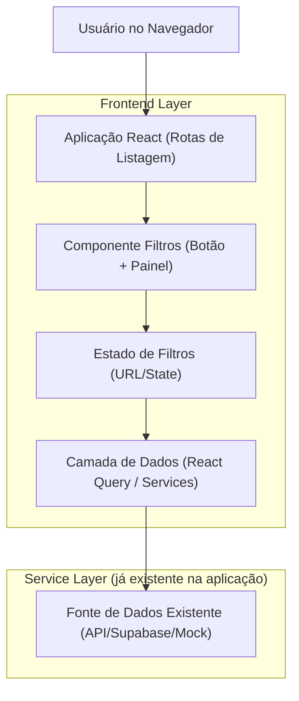

## 1.Architecture design

## 2.Technology Description
- Frontend: React@18 + TypeScript + react-router-dom@6 + tailwindcss@3 + shadcn/ui (Radix UI) + @tanstack/react-query
- Backend: None (o padrão de filtros é 100% frontend e se integra às fontes de dados já usadas hoje)

## 3.Route definitions
O padrão é reutilizado em rotas de listagem já existentes (sem criar novas rotas):

| Route | Purpose |
|-------|---------|
| /representantes | Listagem com filtros padronizados |
| /motoristas | Listagem com filtros padronizados |
| /embarque | Listagem com filtros padronizados |
| /comercial | Listagem com filtros padronizados |
| /pedido-suporte | Listagem com filtros padronizados |
| /producao | Listagem com filtros padronizados |
| /financeiro | Listagem com filtros padronizados |

## 4.API definitions (If it includes backend services)
Não aplicável (sem novos serviços backend para este padrão).

## 6.Data model(if applicable)
Não aplicável (sem alteração de modelo de dados; apenas padronização de UI/estado de filtros).
