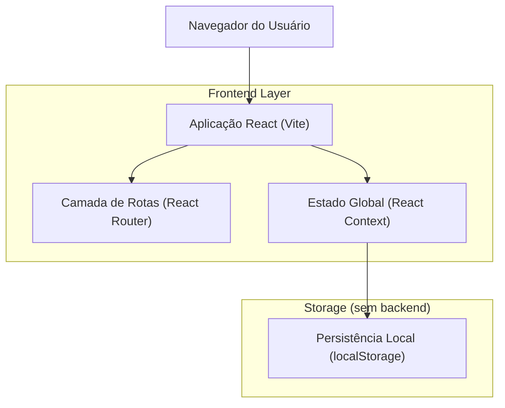

## 1.Architecture design

## 2.Technology Description
- Frontend: React@18 + react-router-dom + tailwindcss@3 + vite
- Backend: None (sem API)
- Persistência: localStorage (sessão, perfil, e dados de domínio em modo local)

## 3.Route definitions
| Route | Purpose |
|-------|---------|
| /login | Login e seleção de perfil (RBAC) |
| / | Dashboard com conteúdo por acesso |
| /representantes | Cadastro de representantes |
| /motoristas | Cadastro de motoristas |
| /embarque | Programação de embarques |
| /embarque/novo | Criar programação |
| /embarque/editar/:id | Editar programação |
| /financeiro | Faturamento/Financeiro (fila e gestão) |
| /pedidos (novo) | Módulo Comercial de pedidos (criar/editar/enviar para faturamento) |

## 4.API definitions (If it includes backend services)
N/A (sem backend).

## 6.Data model(if applicable)
### 6.1 Data model definition
(Armazenamento local / tipos lógicos)
- UserSession: { isAuthenticated, username, name, role, permissions[] }
- Role/Permissions: mapa de perfil → lista de rotas e ações permitidas
- Order (Pedido): { id, clientId, representativeName, date, expiryDate, items[], status, freightValue, driverId? }
- Invoice (Fatura): { id, clientId, orderIds[], issueDate, dueDate, value, paymentMethod, paymentStatus }
- Load (Programação/Embarque): { id, driverId, orderIds[], date, status, estimatedWeight, freightValue }

(Notas de arquitetura)
- RBAC no frontend:
  - Sidebar filtra itens por permissions.
  - Proteção de rota valida permissions e redireciona quando não autorizado.
  - Sessão e perfil persistidos em localStorage.
