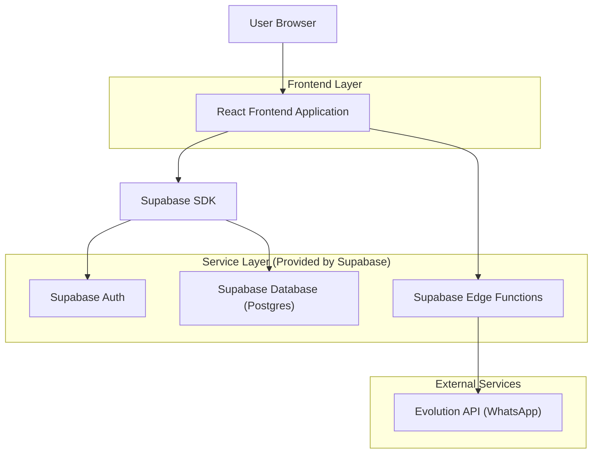
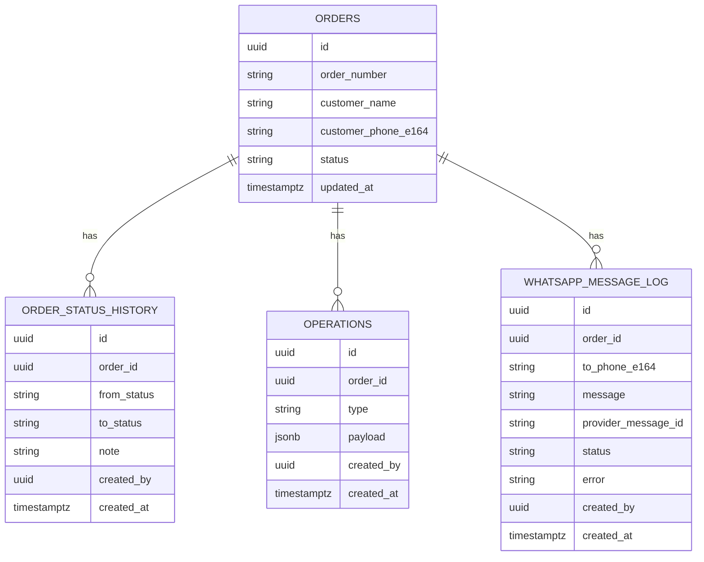

## 1.Architecture design


## 2.Technology Description
- Frontend: React@18 + TypeScript + vite + tailwindcss@3
- Backend: Supabase (Auth + Postgres + Edge Functions)
- External: Evolution API (WhatsApp)

## 3.Route definitions
| Route | Purpose |
|-------|---------|
| /orders | Painel de Pedidos (lista, filtros, detalhe rápido, ações) |
| /orders/:orderId/status | Atualização de Status (transição + envio WhatsApp) |

## 4.API definitions (If it includes backend services)
### 4.1 Edge Functions (WhatsApp)
**Enviar mensagem de status**
```
POST /functions/v1/whatsapp/send-status
```
Request (JSON):
| Param Name| Param Type | isRequired | Description |
|---|---|---|---|
| orderId | string | true | ID do pedido |
| toPhoneE164 | string | true | Telefone destino em E.164 |
| message | string | true | Texto da mensagem |

Response (JSON):
| Param Name| Param Type | Description |
|---|---|---|
| ok | boolean | Sucesso do envio |
| providerMessageId | string | ID retornado pela Evolution (se houver) |
| error | string | Mensagem de erro (se houver) |

**Webhook de status/entrega (opcional, se sua Evolution suportar callback)**
```
POST /functions/v1/whatsapp/webhook
```

### 4.2 Tipos compartilhados (TypeScript)
```ts
export type OrderStatus =
  | "novo"
  | "em_separacao"
  | "faturado"
  | "em_transporte"
  | "entregue"
  | "cancelado";

export type Order = {
  id: string;
  order_number: string;
  customer_name: string;
  customer_phone_e164: string | null;
  status: OrderStatus;
  updated_at: string;
};

export type StatusHistoryItem = {
  id: string;
  order_id: string;
  from_status: OrderStatus;
  to_status: OrderStatus;
  note: string | null;
  created_by: string; // auth.user.id
  created_at: string;
};
```

## 6.Data model(if applicable)
### 6.1 Data model definition


### 6.2 Data Definition Language
```sql
CREATE TABLE orders (
  id uuid PRIMARY KEY DEFAULT gen_random_uuid(),
  order_number text NOT NULL,
  customer_name text NOT NULL,
  customer_phone_e164 text NULL,
  status text NOT NULL,
  updated_at timestamptz NOT NULL DEFAULT now()
);

CREATE TABLE order_status_history (
  id uuid PRIMARY KEY DEFAULT gen_random_uuid(),
  order_id uuid NOT NULL,
  from_status text NOT NULL,
  to_status text NOT NULL,
  note text NULL,
  created_by uuid NOT NULL,
  created_at timestamptz NOT NULL DEFAULT now()
);

CREATE TABLE operations (
  id uuid PRIMARY KEY DEFAULT gen_random_uuid(),
  order_id uuid NOT NULL,
  type text NOT NULL,
  payload jsonb NOT NULL DEFAULT '{}'::jsonb,
  created_by uuid NOT NULL,
  created_at timestamptz NOT NULL DEFAULT now()
);

CREATE TABLE whatsapp_message_log (
  id uuid PRIMARY KEY DEFAULT gen_random_uuid(),
  order_id uuid NOT NULL,
  to_phone_e164 text NOT NULL,
  message text NOT NULL,
  provider_message_id text NULL,
  status text NOT NULL,
  error text NULL,
  created_by uuid NOT NULL,
  created_at timestamptz NOT NULL DEFAULT now()
);

GRANT SELECT ON orders, order_status_history TO anon;
GRANT ALL PRIVILEGES ON orders, order_status_history, operations, whatsapp_message_log TO authenticated;
```
