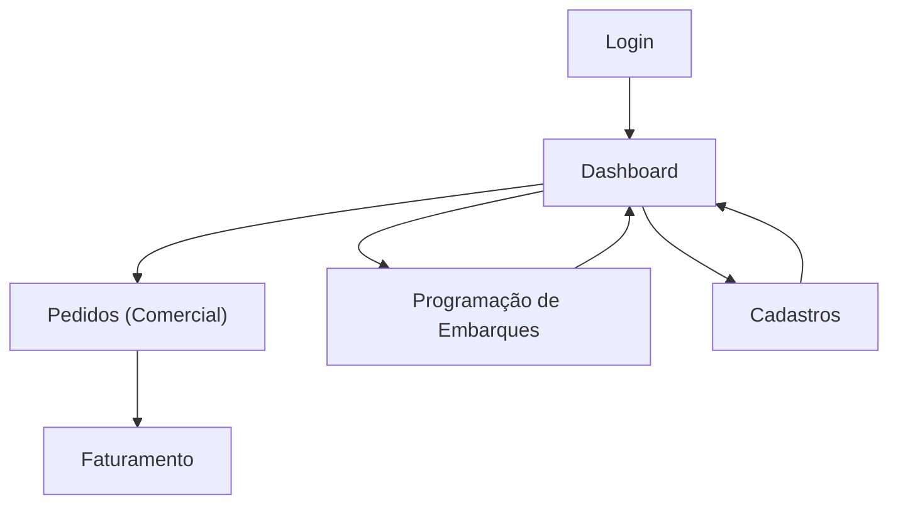

## 1. Product Overview
Aplicação web interna para controlar cadastros, programação de embarques e faturamento.
O foco desta evolução é: login por perfil (RBAC), sidebar dinâmica por acesso e novo fluxo Comercial → Faturamento, mantendo o modelo atual sem backend (dados locais).

## 2. Core Features

### 2.1 User Roles
| Perfil | Método de acesso | Permissões principais |
|------|-------------------|-----------------------|
| Admin | Login + seleção de perfil “Admin” | Acessa todas as páginas e ações (gestão completa). |
| Comercial | Login + seleção de perfil “Comercial” | Gerencia pedidos (criar/editar/enviar para faturamento) e consulta cadastros necessários. |
| Operacional | Login + seleção de perfil “Operacional” | Gerencia programação de embarques (criar/editar/atualizar status) e consulta cadastros necessários. |
| Faturamento | Login + seleção de perfil “Faturamento” | Emite/gerencia faturamento a partir de pedidos elegíveis e atualiza status de pagamento. |

### 2.2 Feature Module
1. **Login**: autenticação local, seleção de perfil, persistência de sessão.
2. **Dashboard**: indicadores e atalhos conforme perfil, visão geral operacional/financeira.
3. **Pedidos (Comercial)**: lista/criação/edição de pedidos e envio do pedido para faturamento.
4. **Programação de Embarques**: criação/edição de programação e acompanhamento de entregas.
5. **Faturamento**: fila de pedidos aptos a faturar, emissão de fatura e atualização de pagamento.
6. **Cadastros**: representantes e motoristas (CRUD conforme perfil).

### 2.3 Page Details
| Page Name | Module Name | Feature description |
|-----------|-------------|---------------------|
| Login | Seleção de perfil | Selecionar perfil (Admin/Comercial/Operacional/Faturamento) antes de entrar no sistema. |
| Login | Autenticação local | Validar entrada mínima (ex.: usuário) e gravar sessão (token/usuário/perfil) em armazenamento local; permitir sair. |
| Dashboard | Conteúdo por acesso | Exibir cartões/atalhos apenas dos módulos permitidos ao perfil; ocultar/ bloquear o restante. |
| Cadastros | Representantes | Listar/criar/editar/excluir representantes conforme acesso do perfil. |
| Cadastros | Motoristas | Listar/criar/editar/excluir motoristas conforme acesso do perfil. |
| Pedidos (Comercial) | Gestão de pedidos | Listar pedidos; criar/editar dados do pedido; alterar status para “Pronto para Faturamento”. |
| Pedidos (Comercial) | Regras de acesso | Bloquear ações de criação/edição para perfis sem permissão; permitir apenas leitura quando aplicável. |
| Programação de Embarques | Gestão de embarques | Criar/editar programação; selecionar motorista; vincular pedidos disponíveis; atualizar status (ex.: Em Trânsito/Entregue). |
| Programação de Embarques | Evidências | Anexar comprovante/nota (mock/local) e registrar como metadado do pedido/programação (sem upload real). |
| Faturamento | Fila de faturamento | Listar pedidos “Pronto para Faturamento”; filtrar/pesquisar; abrir detalhes do pedido. |
| Faturamento | Emissão e pagamento | Gerar fatura (registro local) vinculada a 1+ pedidos; atualizar status de pagamento (Pendente/Pago/Vencido). |
| Global | Sidebar dinâmica (RBAC) | Renderizar itens e seções do menu conforme permissões do perfil; não exibir páginas não permitidas. |
| Global | Proteção de rota | Impedir acesso por URL às rotas sem permissão (redirecionar para Dashboard ou “Sem Acesso”). |

## 3. Core Process
**Fluxo Comercial (Pedidos → Faturamento):** você faz login, seleciona o perfil Comercial, gerencia/cria pedidos e quando um pedido estiver correto você marca como “Pronto para Faturamento”.

**Fluxo Faturamento:** você faz login com perfil Faturamento, vê a fila de pedidos “Pronto para Faturamento”, gera a fatura (registro local) e atualiza o status de pagamento.

**Fluxo Operacional (embarques):** você faz login com perfil Operacional, cria/edita a programação de embarques vinculando pedidos e acompanha o status até “Entregue”.

