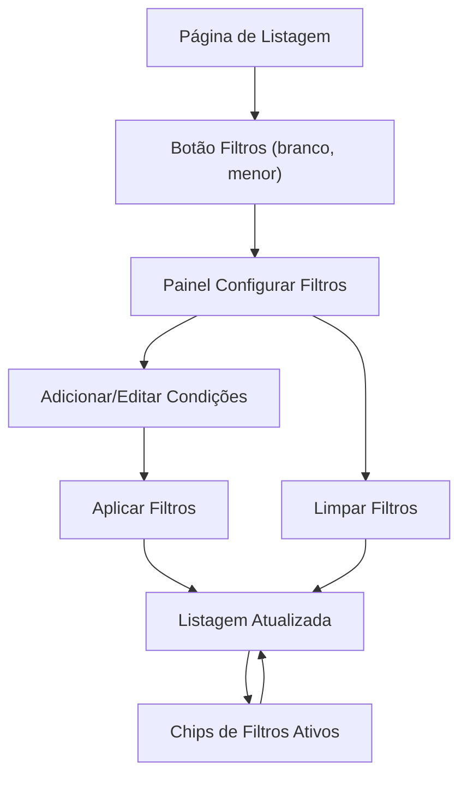

## 1. Product Overview
Padronizar um único componente de filtros para todas as páginas de listagem da aplicação.
Garante consistência visual e de uso: botão branco compacto + painel “Configurar Filtros” com regras claras.

## 2. Core Features

### 2.1 User Roles
Não há diferenciação de papéis para uso do filtro; o padrão se aplica a qualquer usuário com acesso à página.

### 2.2 Feature Module
O padrão de filtros é aplicado nas seguintes “páginas-alvo” (todas as listagens existentes):
1. **Páginas de Listagem (padrão global)**: botão “Filtros” (branco, menor), área de filtros ativos (chips) e atualização do conteúdo listado.
2. **Painel “Configurar Filtros” (overlay)**: criar/remover condições, limpar tudo e aplicar configurações com campo + operador + valor.

### 2.3 Page Details
| Page Name | Module Name | Feature description |
|-----------|-------------|---------------------|
| Páginas de Listagem (padrão global) | Botão “Filtros” (branco, menor) | Abrir o painel “Configurar Filtros”. Manter estilo e posição consistentes em todas as listagens. |
| Páginas de Listagem (padrão global) | Filtros ativos (chips/resumo) | Exibir filtros aplicados de forma legível. Permitir remover um filtro individual. Mostrar estado “sem filtros”. |
| Páginas de Listagem (padrão global) | Aplicação de filtros na listagem | Recarregar/atualizar dados exibidos ao aplicar/alterar filtros. Preservar ordenação/paginação existentes (se houver) sem criar novas regras. |
| Painel “Configurar Filtros” (overlay) | Lista de condições | Adicionar condição. Remover condição. Editar condição com seleção de **Campo + Operador + Valor**. |
| Painel “Configurar Filtros” (overlay) | Ações do painel | Aplicar filtros. Limpar todos os filtros. Fechar/cancelar sem aplicar mudanças. |
| Painel “Configurar Filtros” (overlay) | Validação mínima | Impedir aplicação com condição incompleta (campo/operador/valor ausentes). Indicar visualmente o erro no campo. |

## 3. Core Process
Fluxo do usuário (qualquer página de listagem):
1) Você acessa uma página de listagem.
2) Você clica no botão branco compacto “Filtros”.
3) No painel “Configurar Filtros”, você adiciona uma ou mais condições (campo + operador + valor).
4) Você aplica os filtros para atualizar a listagem.
5) Você remove filtros individualmente pelos chips ou abre o painel e usa “Limpar”.

