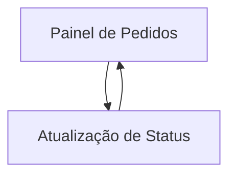

## 1. Product Overview
Sistema interno para acompanhar e atualizar status de pedidos, registrando operações no Supabase.
Inclui sincronização/notificações via WhatsApp usando Evolution API para manter clientes informados.

## 2. Core Features

### 2.1 User Roles
| Role | Registration Method | Core Permissions |
|------|---------------------|------------------|
| Usuário de Operações | Login (Supabase Auth) | Ver pedidos, filtrar, abrir pedido, atualizar status, enviar WhatsApp, registrar operações | 
| Admin | Login (Supabase Auth) | Tudo de Operações + visualizar falhas de envio e reprocessar | 

### 2.2 Feature Module
Os requisitos consistem nas seguintes páginas principais:
1. **Painel de Pedidos**: filtros/pesquisa, lista de pedidos, detalhes rápidos, histórico de status/operações, ações de WhatsApp.
2. **Atualização de Status**: seleção do pedido, transição de status, registro de operação, envio/registro de WhatsApp.

### 2.3 Page Details
| Page Name | Module Name | Feature description |
|-----------|-------------|---------------------|
| Painel de Pedidos | Filtros e busca | Filtrar por período, status atual, cliente e nº do pedido; salvar última busca na sessão. |
| Painel de Pedidos | Lista de pedidos | Exibir tabela com nº pedido, cliente, status atual, última atualização, responsável; abrir detalhes. |
| Painel de Pedidos | Detalhe rápido (painel lateral) | Mostrar dados essenciais do pedido e linha do tempo de status (data, status, usuário, observação). |
| Painel de Pedidos | Operações (auditoria) | Listar operações registradas (tipo, usuário, data, payload resumido) associadas ao pedido. |
| Painel de Pedidos | Ações de WhatsApp | Disparar mensagem de status (manual) e exibir último resultado (enviado/erro) por pedido. |
| Atualização de Status | Seleção de pedido | Abrir pelo clique do painel ou por busca do nº do pedido. |
| Atualização de Status | Transição de status | Atualizar status atual; exigir observação quando aplicável; registrar no histórico. |
| Atualização de Status | Registro de operação | Persistir um registro de operação para cada mudança (antes/depois, usuário, carimbo de data). |
| Atualização de Status | Envio WhatsApp (Evolution API) | Enviar mensagem do novo status; registrar resultado (id externo/erro) para rastreabilidade. |

## 3. Core Process
**Fluxo de Operações**: você acessa o Painel de Pedidos, filtra/encontra um pedido, abre o detalhe, inicia a Atualização de Status, confirma a transição e (opcionalmente) dispara o WhatsApp. O sistema grava histórico de status e uma operação de auditoria; se houver envio, grava também o resultado.

**Fluxo de Admin**: você monitora falhas de envio/pendências no Painel e reprocessa o disparo quando necessário.

